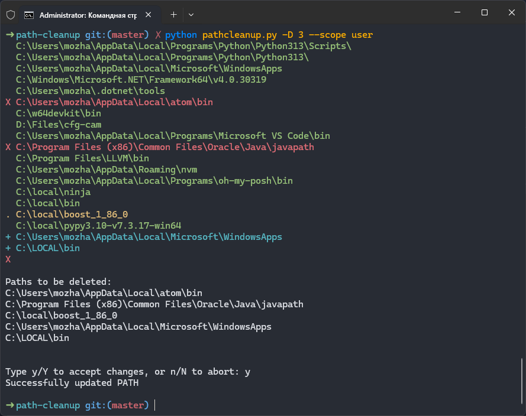

# Path CleanUp
### _Windows only_
## Overview
Tool for deleting unnecessary paths from PATH environment variable. Unnecessary paths include:
+ non-existing paths
+ duplicates
+ empty folders

## Requirements
+ Python 3.x
+ _[optional]_ termcolor (for colored output)

## Usage
```
python pathcleanup.py [-h] [-D {0,1,2}] [-y] [-s {user,system,all}]

options:
  -h, --help            show this help message and exit
  -D {0,1,2}            which folders to delete from PATH
                         0 - don't delete anything (default option)
                         1 - delete non-existing folders
                         2 - delete non-existing and duplicate folders
                         3 - delete non-existing, duplicate and empty folders
  -y                    skip confirmation when deleting
  -s, --scope {user,system,all}
                        which PATH variables to modify
                         user   - user-specific
                         system - system-wide
                         all    - both of these
```

### *Administrator rights*
When modifying system-wide PATH vatiable (`--scope system`), script needs to be runned as administrator (right-click `cmd.exe` and select `Run as administrator`).

## Example
